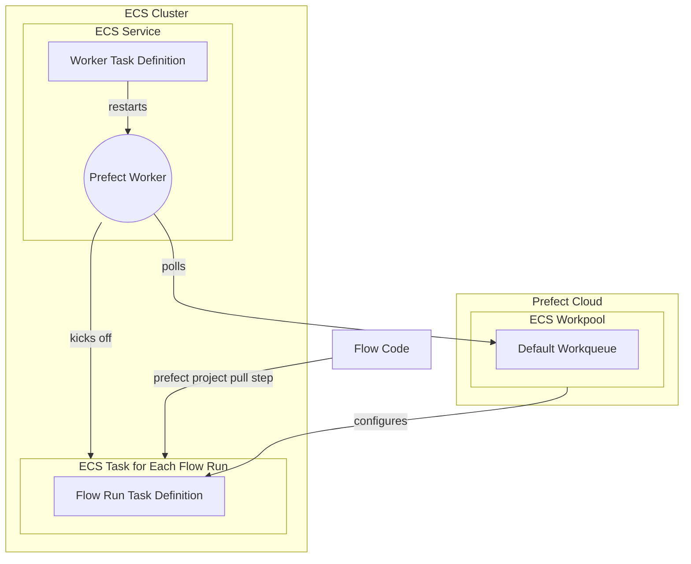

# Deploy an ECS Worker in AWS

## General Introduction



### Why Use ECS for Flow Execution?

ECS (Elastic Container Service) tasks are a good option for hosting Prefect 2 flow runs due to the few reasons:

1. **Scalability**: ECS scales your infrastructure in response to demand, effectively managing Prefect flow runs. It automatically administers container distribution across multiple instances as per demand.
2. **Flexibility**: ECS lets you choose between AWS Fargate and Amazon EC2 for container operation. Fargate abstracts the underlying infrastructure, while EC2 offers control over instance management and configuration. This flexibility enables you to select the option that best fits your needs.
3. **AWS Integration**: Connect with other AWS services, facilitating extensive data pipelines and using AWS IAM and CloudWatch.
4. **Containerization**: ECS supports Docker containers and offers managed execution - containerization encourages reproducable deployments.

!!! tip "ECS Tasks != Prefect Tasks"
    An ECS Task is **not** the same thing as a Prefect task. ECS tasks are run as part of an ECS Cluster, they launch container(s) as defined in the ECS Task definition. An ECS *task definition* is the blueprint for the ECS task that describes which Docker container(s) to run and what you want to have happen inside these container(s).

### ECS in Prefect Terms

The ECS task running the Prefect worker should be an ECS service, given its long-running nature and need for auto-recovery in case of abrupt stops. ECS services ensure a constant number of tasks, replacing any that fail due to errors or instance replacements, making them ideal for managing long-term processes like the Prefect Worker.

Conversely, ECS Tasks are temporary instances of a Task Definition. They launch containers as per the task definition until they're stopped or exit, making them ideal for ephemeral processes like a Prefect Flow Run.

The ECS Work Pool will build a task definition for each flow run based on its configuration, if you do not pass a Task Definition ARN to the Work Pool instead. 

You can use either EC2 or Fargate as capacity providers. Fargate simplifies initiation but lengthens infrastructure setup time for each flow run. Using EC2 for the ECS cluster can lessen this delay.
<hr>

!!! tip
    If you prefer IaC check out this [terraform module](https://github.com/PrefectHQ/prefect-recipes/tree/main/devops/infrastructure-as-code/aws/tf-prefect2-ecs-worker) to provision an ECS cluster with a worker.

## **How to Get Started**

#### Prerequisites
Before you begin, make sure you have:

- An AWS account with permissions to create ECS services and IAM roles.
- The AWS CLI installed on your local machine. You can [download it from the AWS website](https://docs.aws.amazon.com/cli/latest/userguide/getting-started-install.html).
- An [ECS Cluster](https://docs.aws.amazon.com/AmazonECS/latest/developerguide/clusters.html) to host both the worker and the flow runs it submits.
- A VPC configured for your ECS tasks, especially important to have this if you are choosing to use AWS Fargate as the ECS capacity provider.

### Setting Up an ECS Work Pool
Before setting up the worker, you'll want to create a bare-bones [Work Pool](https://docs.prefect.io/latest/concepts/work-pools/#work-pool-configuration) with type ECS so that you have something for the worker to pull from.

Using the Prefect CLI:

`prefect work-pool create --type ecs my-ecs-pool`

Configure the VPC and ECS Cluster for your Work Pool via the UI:


Configuring any custom fields is easiest from the UI.


!!! Warning
    You need to have a VPC specified for your work pool if you are using AWS Fargate.
    

<sub>Pictures of UI Cropped

Next, lets set up an ECS worker that will discover and pull work from this Work Pool.
### Setting up an ECS Worker
Now, you'll want to start a Prefect worker in your ECS cluster.

Create a Docker image for your Prefect worker, which you can build and push to the Amazon ECR registry. 

For example, a minimal Dockerfile for an ECS worker could look like:
```Dockerfile
FROM prefecthq/prefect:2-python3.9
RUN pip install s3fs prefect-aws
```

### Step 1: Create an IAM Role for the ECS Task

To create an IAM role for the ECS task using AWS CLI, you will need to follow these steps: 

1. **Create a Trust Policy**

    The Trust Policy will specify that ECS can assume the role. 
    
    Save this policy to a file, such as `ecs-trust-policy.json`:

    ```json

    {
        "Version": "2012-10-17",
        "Statement": [
            {
                "Effect": "Allow",
                "Principal": {
                    "Service": "ecs-tasks.amazonaws.com"
                },
                "Action": "sts:AssumeRole"
            }
        ]
    }
    ```

 
2. **Create the IAM Role**

    Use the `aws iam create-role` command to create the role:

    ```bash

    aws iam create-role \ 
    --role-name ecsTaskExecutionRole \
    --assume-role-policy-document file://ecs-trust-policy.json
    ```

 
3. **Attach the Policy to the Role**

    Amazon has a managed policy named `AmazonECSTaskExecutionRolePolicy` that grants the permissions necessary for ECS tasks. Attach this policy to your role:

    ```bash

    aws iam attach-role-policy \
    --role-name ecsTaskExecutionRole \ 
    --policy-arn arn:aws:iam::aws:policy/service-role/AmazonECSTaskExecutionRolePolicy
    ```


Remember to replace the `--role-name` and `--policy-arn` with the actual role name and policy Amazon Resource Name (ARN) you want to use.

Now, you have a role named `ecsTaskExecutionRole` that you can assign to your ECS tasks. This role has the necessary permissions to pull container images and publish logs to CloudWatch.


### Step 2: Create a Task Definition

Next, you need to create an ECS task definition that specifies the Docker image for the Prefect worker, the resources it requires, and the command it should run, in our case `prefect worker start --pool my-ecs-pool`. 

Here are the steps:

1. Create a JSON file with the following contents:

```json
{
  "family": "prefect-worker-task",
  "networkMode": "awsvpc",
  "taskRoleArn": "<your-ecs-task-role-arn>",
  "executionRoleArn": "<your-ecs-task-role-arn>",
  "containerDefinitions": [
    {
      "name": "prefect-worker",
      "image": "<your-ecr-image>",
      "cpu": 512,
      "memory": 1024,
      "essential": true,
      "command": [
        "prefect",
        "worker",
        "start",
        "--pool",
        "my-ecs-pool"
      ],
      "environment": [
        {
          "name": "PREFECT_API_URL",
          "value": "https://api.prefect.cloud/api/accounts/<your-account-id>/workspaces/<your-workspace-id>"
        },
        {
          "name": "PREFECT_API_KEY",
          "value": "<your-api-key>"
        }
      ]
    }
  ]
}
```

- Use `prefect config view` to see the values for `PREFECT_API_URL`. For the `PREFECT_API_KEY`, organization tier can create a [service account](https://docs.prefect.io/latest/cloud/users/service-accounts/) for the worker, personal tiers can pass a user’s API key here.
- Replace `<your-ecs-task-role-arn>` with the ARN of the IAM role you created in Step 1, and `<your-ecr-image>` with the URI of the Docker image you pushed to Amazon ECR.
- As you can see the CPU and Memory allocations are relatively small given that the workers main responsibility is to submit work _not_ to execute your Prefect flow.

!!! tip 
    To avoid hardcoding your API key into the task definition JSON see [how to add environment variables to the container definition](https://docs.aws.amazon.com/AmazonECS/latest/developerguide/secrets-envvar-secrets-manager.html#secrets-envvar-secrets-manager-update-container-definition).


### Step 3: Create an ECS Service to host your Worker

Finally, you can create an service that will manage your Prefect worker. 

Here are the steps:

1. Open a terminal window and run the following command to create an ECS Fargate service:

```bash
aws ecs create-service \
    --service-name prefect-worker-service \
    --cluster <your-ecs-cluster> \
    --task-definition file://<path-to-task-definition-file>.json \
    --launch-type FARGATE \
    --desired-count 1 \
    --network-configuration "awsvpcConfiguration={subnets=[<your-subnet-ids>],securityGroups=[<your-security-group-ids>]}"
```


Replace `<your-ecs-cluster>` with the name of your ECS cluster, `<path-to-task-definition-file>` with the path to the JSON file you created in Step 2, `<your-subnet-ids>` with a comma-separated list of your VPC subnet IDs, and `<your-security-group-ids>` with a comma-separated list of your VPC security group IDs.

!!! tip "Sanity Check"
    The work pool page in the Prefect UI allows you to check the health of your workers - make sure your new worker is alive!

### Now pick up a flow run with our new worker!

1. Write a simple test flow:

    `my_flow.py`
    ```python
    from prefect import flow, get_run_logger

    @flow
    def my_flow():
        logger = get_run_logger()
        logger.info("Hello from ECS!!")
    ```

2. [Create a Prefect Project](https://docs.prefect.io/latest/tutorials/projects/#initializing-a-project) and, most importantly, define a [pull step](https://docs.prefect.io/latest/concepts/projects/#the-pull-section) to allow the worker to access your flow code.


3. Deploy a flow to the ECS Work Pool

    ```bash
    prefect deploy my_flow.py:my_flow --name ecs-test-deployment --pool my-ecs-pool
    ```

4. Find the deployment in the UI and click the **Quick Run** button!

### Next Steps
!!! Reminder
    Flow run infrastructure configuration is set a the [Work Pool](https://docs.prefect.io/latest/concepts/work-pools/#work-pool-overview) or [Deployment](https://docs.prefect.io/latest/concepts/deployments/) level.

Now that you are confident the ECS Worker is healthy, you can experiment with different Work Pool configurations. 

- Do your flow runs require higher `CPU`?
- Would an EC2 `Launch Type` speed up your flow run execution? 

These infrastructure configuration values can be set on your ECS Work Pool or they can be [overriden on the deployment level](https://docs.prefect.io/latest/concepts/infrastructure/#kubernetesjob-overrides-and-customizations) if desired.

