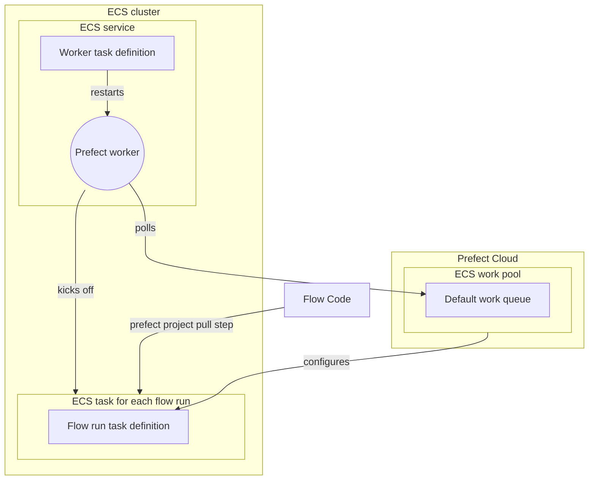

## Why use ECS for flow execution?

ECS (Elastic Container Service) tasks are a good option for executing Prefect 2 flow runs for several reasons:

1. **Scalability**: ECS scales your infrastructure in response to demand, effectively managing Prefect flow runs. ECS automatically administers container distribution across multiple instances based on demand.
1. **Flexibility**: ECS lets you choose between AWS Fargate and Amazon EC2 for container operation. Fargate abstracts the underlying infrastructure, while EC2 has faster job start times and offers additional control over instance management and configuration. 
1. **AWS Integration**: Easily connect with other AWS services, such as AWS IAM and CloudWatch.
1. **Containerization**: ECS supports Docker containers and offers managed execution. Containerization encourages reproducable deployments.

!!! tip "ECS tasks != Prefect tasks"
    An ECS Task is **not** the same thing as a Prefect task. ECS tasks are run as part of an ECS Cluster, they launch containers as defined in the ECS Task definition. An [*ECS task definition*](https://docs.aws.amazon.com/AmazonECS/latest/developerguide/task_definitions.html) is the blueprint for the ECS task. It describes which Docker containers to run and what you want to have happen inside these containers.

## ECS in Prefect

The ECS task running the Prefect worker should be an [*ECS service*](https://docs.aws.amazon.com/AmazonECS/latest/developerguide/ecs_services.html), given its long-running nature and need for auto-recovery in case of failure. ECS services seek to maintain the requested number of tasks. An ECS service automatically replaces any task that fails, which is ideal for managing a long-running process such as a Prefect worker.

An ECS task definition describes creation of an ECS task. ECS tasks launch containers as specified in the task definition until the number of containers is met. This setup is ideal for ephemeral processes such as a Prefect flow run. 

Once the flow run completes, the ECS containers are spun down to a single container that runs the Prefect worker. This worker continues polling for work from the Prefect work pool.

When a Prefect [flow](https://docs.prefect.io/latest/concepts/flows/) is scheduled to run, that information is sent to the Prefect work pool specified in the flow's [deployment](https://docs.prefect.io/latest/concepts/deployments). [Work pools](https://docs.prefect.io/latest/concepts/work-pools/?h=work#work-pool-overview) are typed according to the infrastructure the flow will run on. The ECS work pool type is used with ECS. The Prefect [worker](https://docs.prefect.io/latest/concepts/work-pools/#worker-types) polling the work pool for work will have a matching ECS type.  

When the ECS worker finds a scheduled flow run in the ECS work pool it is polling, it spins up the specified infrastructure on AWS ECS. The worker knows to build an ECS task definition for each flow run based on the configuration specified in the work pool. 

If you specify a task definition [ARN (Amazon Resource Name)](https://docs.aws.amazon.com/IAM/latest/UserGuide/reference-arns.html) in the work pool, the worker will use that ARN when spinning up the EC2 instance, rather than creating a new ECS Fargate container.


You can use either EC2 or Fargate as the capacity provider. Fargate simplifies initiation and provides containerization, but lengthens infrastructure setup time for each flow run. Using EC2 for the ECS cluster can reduce setup time. In this example, we will show how to use Fargate.
<hr>

!!! tip
    If you prefer infrastructure as code check out this [Terraform module](https://github.com/PrefectHQ/prefect-recipes/tree/main/devops/infrastructure-as-code/aws/tf-prefect2-ecs-worker) to provision an ECS cluster with a worker.

# Architectural Diagram



## Prerequisites
Before you begin, make sure you have:

- An AWS account with permissions to create ECS services and IAM roles.
- The AWS CLI installed on your local machine. You can [download it from the AWS website](https://docs.aws.amazon.com/cli/latest/userguide/getting-started-install.html).
- An [ECS Cluster](https://docs.aws.amazon.com/AmazonECS/latest/developerguide/clusters.html) to host both the worker and the flow runs it submits.
- A [VPC](https://docs.aws.amazon.com/vpc/latest/userguide/what-is-amazon-vpc.html) configured for your ECS tasks. A VPC is a good idea if using EC2 and required if using Fargate. TK is this true?

## Step 1: Set Up an ECS work pool
Before setting up the worker, create a simple [work pool](https://docs.prefect.io/latest/concepts/work-pools/#work-pool-configuration) of type ECS for the worker to pull work from.

Create a work pool from the Prefect UI or CLI:

`prefect work-pool create --type ecs my-ecs-pool`

Configure the VPC and ECS Cluster for your Work Pool via the UI:


Configuring custom fields is easiest from the UI.


!!! Warning
    You need to have a VPC specified for your work pool if you are using AWS Fargate.
    

<sub>Pictures of UI Cropped

Next, set up an Prefect ECS worker that will discover and pull work from this work pool.
## Step 2: Set up an ECS worker
Start a Prefect worker in your ECS cluster.

Create a Docker image for your Prefect worker, which you can build and push to the Amazon ECR registry. TK do you have to?

For example, a minimal Dockerfile for an ECS worker could look like:
```Dockerfile
FROM prefecthq/prefect:2-python3.10
RUN pip install s3fs prefect-aws
```

### Step 3: Create an IAM Role for the ECS task

To create an IAM role for the ECS task using the AWS CLI, follow these steps: 

1. **Create a Trust Policy**

    The Trust Policy will specify that ECS can assume the role. 
    
    Save this policy to a file, such as `ecs-trust-policy.json`:

    ```json

    {
        "Version": "2012-10-17",
        "Statement": [
            {
                "Effect": "Allow",
                "Principal": {
                    "Service": "ecs-tasks.amazonaws.com"
                },
                "Action": "sts:AssumeRole"
            }
        ]
    }
    ```

 
2. **Create the IAM Role**

    Use the `aws iam create-role` command to create the role:

    ```bash

    aws iam create-role \ 
    --role-name ecsTaskExecutionRole \
    --assume-role-policy-document file://ecs-trust-policy.json
    ```

 
3. **Attach the Policy to the Role**

    Amazon has a managed policy named `AmazonECSTaskExecutionRolePolicy` that grants the permissions necessary for ECS tasks. Attach this policy to your role:

    ```bash

    aws iam attach-role-policy \
    --role-name ecsTaskExecutionRole \ 
    --policy-arn arn:aws:iam::aws:policy/service-role/AmazonECSTaskExecutionRolePolicy
    ```


Remember to replace the `--role-name` and `--policy-arn` with the actual role name and policy Amazon Resource Name (ARN) you want to use.

Now, you have a role named `ecsTaskExecutionRole` that you can assign to your ECS tasks. This role has the necessary permissions to pull container images and publish logs to CloudWatch.


### Step 4: Create a task definition

Next, create an ECS task definition that specifies the Docker image for the Prefect worker, the resources it requires, and the command it should run. In this example our command to run is `prefect worker start --pool my-ecs-pool`. 

Here are the steps:

1. Create a JSON file with the following contents:

```json
{
  "family": "prefect-worker-task",
  "networkMode": "awsvpc",
  "taskRoleArn": "<your-ecs-task-role-arn>",
  "executionRoleArn": "<your-ecs-task-role-arn>",
  "containerDefinitions": [
    {
      "name": "prefect-worker",
      "image": "<your-ecr-image>",
      "cpu": 512,
      "memory": 1024,
      "essential": true,
      "command": [
        "prefect",
        "worker",
        "start",
        "--pool",
        "my-ecs-pool"
      ],
      "environment": [
        {
          "name": "PREFECT_API_URL",
          "value": "https://api.prefect.cloud/api/accounts/<your-account-id>/workspaces/<your-workspace-id>"
        },
        {
          "name": "PREFECT_API_KEY",
          "value": "<your-api-key>"
        }
      ]
    }
  ]
}
```

- Use `prefect config view` to see the values for `PREFECT_API_URL`. 

- For the `PREFECT_API_KEY`, individuals on the organization tier can create a [service account](https://docs.prefect.io/latest/cloud/users/service-accounts/) for the worker. If on a personal tier, you can pass a user’s API key.
- Replace `<your-ecs-task-role-arn>` with the ARN of the IAM role you created in Step 1, and `<your-ecr-image>` with the URI of the Docker image you pushed to Amazon ECR.
- Notice that the CPU and Memory allocations are relatively small. The worker's main responsibility is to submit work, _not_ to execute your Prefect flow code.

!!! tip 
    To avoid hardcoding your API key into the task definition JSON see [how to add environment variables to the container definition](https://docs.aws.amazon.com/AmazonECS/latest/developerguide/secrets-envvar-secrets-manager.html#secrets-envvar-secrets-manager-update-container-definition).


### Step 5: Create an ECS service to host your worker

Finally, create a service that will manage your Prefect worker. 

Here are the steps:

1. Open a terminal window and run the following command to create an ECS Fargate service:

```bash
aws ecs create-service \
    --service-name prefect-worker-service \
    --cluster <your-ecs-cluster> \
    --task-definition file://<path-to-task-definition-file>.json \
    --launch-type FARGATE \
    --desired-count 1 \
    --network-configuration "awsvpcConfiguration={subnets=[<your-subnet-ids>],securityGroups=[<your-security-group-ids>]}"
```

Replace `<your-ecs-cluster>` with the name of your ECS cluster, `<path-to-task-definition-file>` with the path to the JSON file you created in Step 2, `<your-subnet-ids>` with a comma-separated list of your VPC subnet IDs, and `<your-security-group-ids>` with a comma-separated list of your VPC security group IDs.

!!! tip "Sanity check"
    The work pool page in the Prefect UI allows you to check the health of your workers - make sure your new worker is live!

### Step 6: Pick up a flow run with your new worker!

1. Write a simple test flow:

    `my_flow.py`
    ```python
    from prefect import flow, get_run_logger

    @flow
    def my_flow():
        logger = get_run_logger()
        logger.info("Hello from ECS!!")
    ```

2. [Create a Prefect project](https://docs.prefect.io/latest/tutorials/projects/#initializing-a-project).  In the `prefect.yaml` file, specify the code in the [pull step](https://docs.prefect.io/latest/concepts/projects/#the-pull-section) to allow the worker to access your flow code.

TK good to show the code in text - copy-able flow code


3. Deploy the flow to the server, specifying the ECS work pool

    ```bash
    prefect deploy my_flow.py:my_flow --name ecs-test-deployment --pool my-ecs-pool
    ```

4. Find the deployment in the UI and click the **Quick Run** button!

TK maybe good to show an image here, the interface my change, but finding a deployment isn't super easy ATM

## Next steps

Now that you are confident your ECS worker is healthy, you can experiment with different work pool configurations. 

- Do your flow runs require higher `CPU`?
- Would an EC2 `Launch Type` speed up your flow run execution? 

These infrastructure configuration values can be set on your ECS work pool or they can be [overriden on the deployment level](https://docs.prefect.io/latest/concepts/infrastructure/#kubernetesjob-overrides-and-customizations) if desired.

