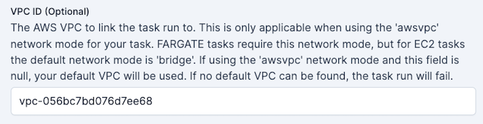

# ECS Worker Guide

## Why use ECS for flow run execution?

ECS (Elastic Container Service) tasks are a good option for executing Prefect 2 flow runs for several reasons:

1. **Scalability**: ECS scales your infrastructure in response to demand, effectively managing Prefect flow runs. ECS automatically administers container distribution across multiple instances based on demand.
2. **Flexibility**: ECS lets you choose between AWS Fargate and Amazon EC2 for container operation. Fargate abstracts the underlying infrastructure, while EC2 has faster job start times and offers additional control over instance management and configuration.
3. **AWS Integration**: Easily connect with other AWS services, such as AWS IAM and CloudWatch.
4. **Containerization**: ECS supports Docker containers and offers managed execution. Containerization encourages reproducible deployments.

## ECS Flow Run Execution

Prefect enables remote flow execution via [workers](https://docs.prefect.io/2.11.1/concepts/work-pools/#worker-overview) and [work pools](https://docs.prefect.io/2.11.1/concepts/work-pools/#work-pool-overview). To learn more about these concepts please see our [deployment tutorial](https://docs.prefect.io/2.11.1/tutorial/deployments/).

For details on how workers and work pools are implemented for ECS, see the diagram below:
#### Architecture Diagram

### ECS in Prefect Terms
!!! tip "ECS tasks != Prefect tasks"
    An ECS task is **not** the same thing as a [Prefect task](https://docs.prefect.io/latest/concepts/tasks/#tasks-overview). 
    
    ECS tasks are groupings of containers that run within an ECS Cluster. An ECS task's behavior is determined by its task definition. 
    
    An [*ECS task definition*](https://docs.aws.amazon.com/AmazonECS/latest/developerguide/task_definitions.html) is the blueprint for the ECS task. It describes which Docker containers to run and what you want to have happen inside these containers.

ECS tasks are instances of a task definition. A Task Execution launches container(s) as defined in the task definition **until they are stopped or exit on their own**. This setup is ideal for ephemeral processes such as a Prefect flow run.

The ECS task running the Prefect [worker](https://docs.prefect.io/latest/concepts/work-pools/#worker-overview) should be an [**ECS Service**](https://docs.aws.amazon.com/AmazonECS/latest/developerguide/ecs_services.html), given its long-running nature and need for **auto-recovery in case of failure**. An ECS service automatically replaces any task that fails, which is ideal for managing a long-running process such as a Prefect worker.

When a Prefect [flow](https://docs.prefect.io/latest/concepts/flows/) is scheduled to run it goes into the work pool specified in the flow's [deployment](https://docs.prefect.io/latest/concepts/deployments). [Work pools](https://docs.prefect.io/latest/concepts/work-pools/?h=work#work-pool-overview) are typed according to the infrastructure the flow will run on. Flow runs scheduled in an `ecs` typed work pool are executed as ECS tasks. Only Prefect ECS [workers](https://docs.prefect.io/latest/concepts/work-pools/#worker-types) can poll an `ecs` typed work pool.

When the ECS worker receives a scheduled flow run from the ECS work pool it is polling, it spins up the specified infrastructure on AWS ECS. The worker knows to build an ECS task definition for each flow run based on the configuration specified in the work pool.

Once the flow run completes, the ECS containers of the cluster are spun down to a single container that continues to run the Prefect worker. This worker continues polling for work from the Prefect work pool.

If you specify a task definition [ARN (Amazon Resource Name)](https://docs.aws.amazon.com/IAM/latest/UserGuide/reference-arns.html) in the work pool, the worker will use that ARN when spinning up the ECS Task, rather than creating a task definition from the fields supplied in the work pool configuration.

You can use either EC2 or Fargate as the capacity provider. Fargate simplifies initiation, but lengthens infrastructure setup time for each flow run. Using EC2 for the ECS cluster can reduce setup time. In this example, we will show how to use Fargate.

<hr>

# AWS CLI Guide

!!! tip
    If you prefer infrastructure as code check out this [Terraform module](https://github.com/PrefectHQ/prefect-recipes/tree/main/devops/infrastructure-as-code/aws/tf-prefect2-ecs-worker) to provision an ECS cluster with a worker.
### Prerequisites

Before you begin, make sure you have:

- An AWS account with permissions to create ECS services and IAM roles.
- The AWS CLI installed on your local machine. You can [download it from the AWS website](https://docs.aws.amazon.com/cli/latest/userguide/getting-started-install.html).
- An [ECS Cluster](https://docs.aws.amazon.com/AmazonECS/latest/developerguide/clusters.html) to host both the worker and the flow runs it submits. Follow [this guide](https://docs.aws.amazon.com/AmazonECS/latest/userguide/create_cluster.html) to create an ECS cluster or simply use the default cluster.
- A [VPC](https://docs.aws.amazon.com/vpc/latest/userguide/what-is-amazon-vpc.html) configured for your ECS tasks. A VPC is a good idea if using EC2 and required if using Fargate.

### Step 1: Set Up an ECS work pool

Before setting up the worker, create a simple [work pool](https://docs.prefect.io/latest/concepts/work-pools/#work-pool-configuration) of type ECS for the worker to pull work from.

Create a work pool from the Prefect UI or CLI:

```bash
prefect work-pool create --type ecs my-ecs-pool
```

Configure the VPC and ECS cluster for your work pool via the UI:


Configuring custom fields is easiest from the UI.


!!! Warning
    You need to have a VPC specified for your work pool if you are using AWS Fargate.


Next, set up a Prefect ECS worker that will discover and pull work from this work pool.

### Step 2: Start a Prefect worker in your ECS cluster.


To create an [IAM role](https://docs.aws.amazon.com/IAM/latest/UserGuide/id_roles_create_for-custom.html#roles-creatingrole-custom-trust-policy-console) for the ECS task using the AWS CLI, follow these steps:

1. **Create a trust policy**

    The trust policy will specify that ECS can assume the role.

    Save this policy to a file, such as `ecs-trust-policy.json`:

    ```json

    {
        "Version": "2012-10-17",
        "Statement": [
            {
                "Effect": "Allow",
                "Principal": {
                    "Service": "ecs-tasks.amazonaws.com"
                },
                "Action": "sts:AssumeRole"
            }
        ]
    }
    ```

2. **Create the IAM role**

    Use the `aws iam create-role` command to create the role:

    ```bash

    aws iam create-role \ 
    --role-name ecsTaskExecutionRole \
    --assume-role-policy-document file://ecs-trust-policy.json
    ```

3. **Attach the policy to the role**

    Amazon has a managed policy named `AmazonECSTaskExecutionRolePolicy` that grants the permissions necessary for ECS tasks. Attach this policy to your role:

    ```bash

    aws iam attach-role-policy \
    --role-name ecsTaskExecutionRole \ 
    --policy-arn arn:aws:iam::aws:policy/service-role/AmazonECSTaskExecutionRolePolicy
    ```

    Remember to replace the `--role-name` and `--policy-arn` with the actual role name and policy Amazon Resource Name (ARN) you want to use.

    Now, you have a role named `ecsTaskExecutionRole` that you can assign to your ECS tasks. This role has the necessary permissions to pull container images and publish logs to CloudWatch.

4. **Launch an ECS Service to host the worker**

    Next, create an ECS task definition that specifies the Docker image for the Prefect worker, the resources it requires, and the command it should run. In this example, the command to start the worker is `prefect worker start --pool my-ecs-pool`.

    **Create a JSON file with the following contents:**

    ```json
    {
        "family": "prefect-worker-task",
        "networkMode": "awsvpc",
        "requiresCompatibilities": [
            "FARGATE"
        ],
        "cpu": "512",
        "memory": "1024",
        "executionRoleArn": "<your-ecs-task-role-arn>",
        "taskRoleArn": "<your-ecs-task-role-arn>",
        "containerDefinitions": [
            {
                "name": "prefect-worker",
                "image": "prefecthq/prefect",
                "cpu": 512,
                "memory": 1024,
                "essential": true,
                "command": [
                    "pip",
                    "install",
                    "prefect-aws",
                    "&&",
                    "prefect",
                    "worker",
                    "start",
                    "--pool",
                    "my-ecs-pool",
                    "--type",
                    "ecs"
                ],
                "environment": [
                    {
                        "name": "PREFECT_API_URL",
                        "value": "https://api.prefect.cloud/api/accounts/<your-account-id>/workspaces/<your-workspace-id>"
                    },
                    {
                        "name": "PREFECT_API_KEY",
                        "value": "<your-prefect-api-key>"
                    }
                ]
            }
        ]
    }
    ```

    - Use `prefect config view` to view the `PREFECT_API_URL` for your current Prefect profile. Use this to replace both `<your-account-id>` and `<your-workspace-id>`.

    - For the `PREFECT_API_KEY`, individuals on the organization tier can create a [service account](https://docs.prefect.io/latest/cloud/users/service-accounts/) for the worker. If on a personal tier, you can pass a user’s API key.

    - Replace `<your-ecs-task-role-arn>` with the ARN of the IAM role you created in Step 1.

    - Notice that the CPU and Memory allocations are relatively small. The worker's main responsibility is to submit work through API calls to AWS, _not_ to execute your Prefect flow code.

    !!! tip
        To avoid hardcoding your API key into the task definition JSON see [how to add environment variables to the container definition](https://docs.aws.amazon.com/AmazonECS/latest/developerguide/secrets-envvar-secrets-manager.html#secrets-envvar-secrets-manager-update-container-definition). The API key must be stored as plain text, not the key-value pair dictionary that it is formatted in by default.

6. **Register the task definition:**
    
    Before creating a service, you first need to register a task definition. You can do that using the `register-task-definition` command in the AWS CLI. Here is an example:

    ```bash

    aws ecs register-task-definition --cli-input-json file://task-definition.json
    ```


    Replace `task-definition.json` with the name of your JSON file.

7. **Create an ECS service to host your worker:**

    Finally, create a service that will manage your Prefect worker:

    Open a terminal window and run the following command to create an ECS Fargate service:

    ```bash
    aws ecs create-service \
        --service-name prefect-worker-service \
        --cluster <your-ecs-cluster> \
        --task-definition <task-definition-arn> \
        --launch-type FARGATE \
        --desired-count 1 \
        --network-configuration "awsvpcConfiguration={subnets=[<your-subnet-ids>],securityGroups=[<your-security-group-ids>]}"
    ```

    - Replace `<your-ecs-cluster>` with the name of your ECS cluster. 
    - Replace `<path-to-task-definition-file>` with the path to the JSON file you created in Step 2, `<your-subnet-ids>` with a comma-separated list of your VPC subnet IDs. Ensure that these subnets are aligned with the vpc specified on the work pool in step 1.
    - Replace `<your-security-group-ids>` with a comma-separated list of your VPC security group IDs. 
    - Replace `<task-definition-arn>` with the ARN of the task definition you just registered.

    !!! tip "Sanity check"
        The work pool page in the Prefect UI allows you to check the health of your workers - make sure your new worker is live!

### Step 4: Pick up a flow run with your new worker!

1. Write a simple test flow in a repo of your choice:

    `my_flow.py`

    ```python
    from prefect import flow, get_run_logger

    @flow
    def my_flow():
        logger = get_run_logger()
        logger.info("Hello from ECS!!")

    if __name__ == "__main__":
        my_flow()
    ```

2. [Deploy](https://docs.prefect.io/2.11.0/tutorial/deployments/#create-a-deployment) the flow to the server, specifying the ECS work pool when prompted.

    ```bash
    prefect deploy my_flow.py:my_flow
    ```

3. Find the deployment in the UI and click the **Quick Run** button!


## Optional Next Steps

1. Now that you are confident your ECS worker is healthy, you can experiment with different work pool configurations.

    - Do your flow runs require higher `CPU`?
    - Would an EC2 `Launch Type` speed up your flow run execution?

    These infrastructure configuration values can be set on your ECS work pool or they can be overridden on the deployment level through [job_variables](https://docs.prefect.io/2.11.0/concepts/infrastructure/#kubernetesjob-overrides-and-customizations) if desired.


2. Consider adding a [build action](https://docs.prefect.io/2.11.0/concepts/deployments-ux/#the-build-action) to your Prefect Project [`prefect.yaml`](https://docs.prefect.io/2.11.0/concepts/deployments-ux/#the-prefect-yaml-file) if you want to automatically build a Docker image and push it to an image registry `prefect deploy` is run.

Here is an example build action for ECR:
    ```yaml
    build:
    - prefect.deployments.steps.run_shell_script:
        id: get-commit-hash
        script: git rev-parse --short HEAD
        stream_output: false
    - prefect.deployments.steps.run_shell_script:
        id: ecr-auth-step
        script: aws ecr get-login-password --region <region> | docker login --username
            AWS --password-stdin <>.dkr.ecr.<region>.amazonaws.com
        stream_output: false
    - prefect_docker.deployments.steps.build_docker_image:
        requires: prefect-docker>=0.3.0
        image_name: <your-AWS-account-number>.dkr.ecr.us-east-2.amazonaws.com/<registry>
        tag: '{{ get-commit-hash.stdout }}'
        dockerfile: auto
        push: true
    ```
